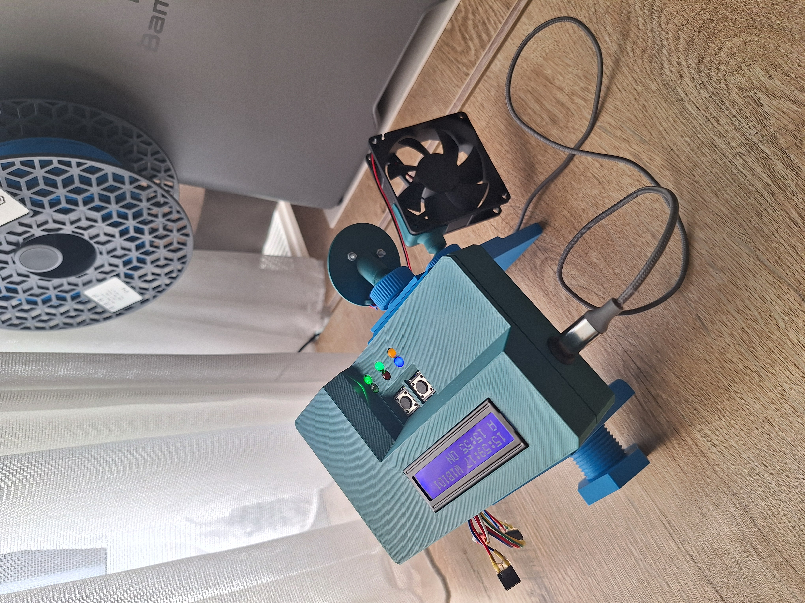
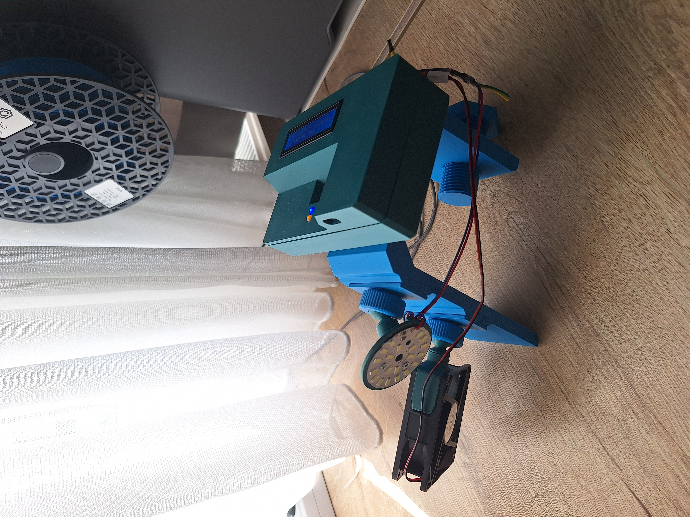
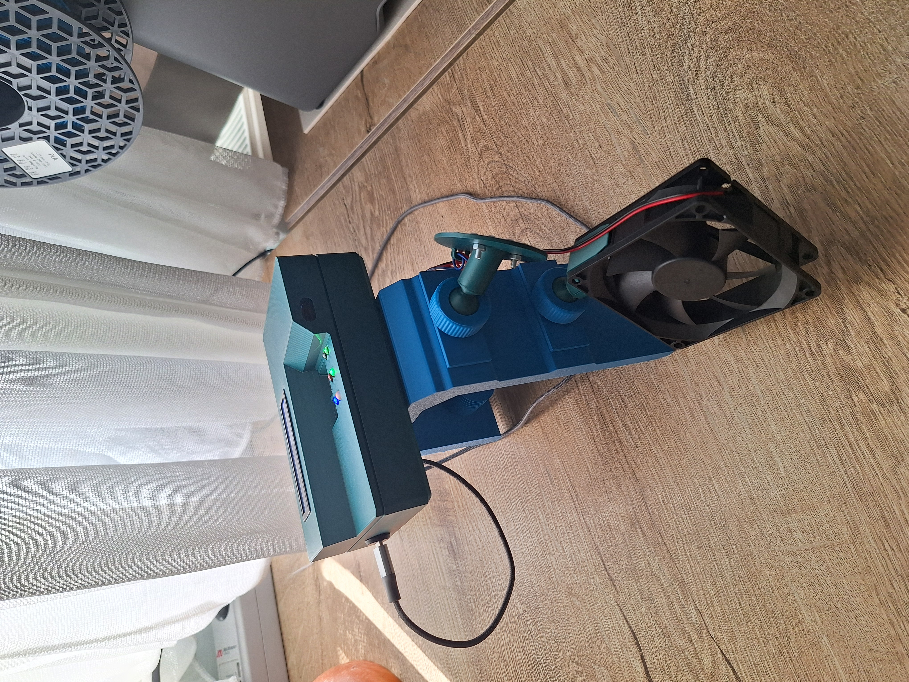

# ESP32 Multisensory Alarm

An ESP32-S3 based alarm system that combines **high-power light, airflow, and an optional active buzzer** to create a configurable wake-up sequence.

The system includes Blynk remote control, an I2C LCD, physical buttons, status LEDs, custom CAD, and an electrical schematic.

  
  
  

## Features

- ESP32-S3 controller
- 10 W LED with PWM brightness control
- Fan-based airflow
- Optional removable active buzzer
- Configurable alarm time, duration, repeats, and intensity
- Blynk remote control
- NTP time synchronization
- 16x2 I2C LCD
- Physical controls and status LEDs
- Custom 3D-printed enclosure
- Hardware test firmware
- CAD and schematic files included

## Demo

[Watch the demonstration](media/demonstration.mp4)

## Hardware

Main components:

- ESP32-S3
- 10 W LED
- MX1508 driver
- 12 V fan
- Optional active buzzer
- 16x2 I2C LCD
- Two pushbuttons
- Status LEDs
- MOSFETs

Electrical schematic:

[ESP32-S3 Alarm Schematic](hardware/esp32s3-alarm-schematic.pdf)

CAD files:

`hardware/cad-files/`

## Firmware

Main firmware:

`firmware/alarm.ino`

Hardware test:

`firmware/hardware-test.ino`

The firmware handles:

- alarm scheduling
- progressive light patterns
- fan ramping
- Blynk synchronization
- Wi-Fi reconnection
- LCD interface
- status LEDs
- physical buttons

# Contributing

Contributions are welcome.

If you find a bug or have an improvement:

1. Open an issue describing the problem or proposed change.
2. Fork the repository.
3. Create a branch for your change.
4. Submit a pull request.

Please avoid committing credentials, generated build files, or
proprietary third-party files.

By submitting a contribution, you agree that your contribution may be
distributed under the license applicable to the part of the project
being modified.
